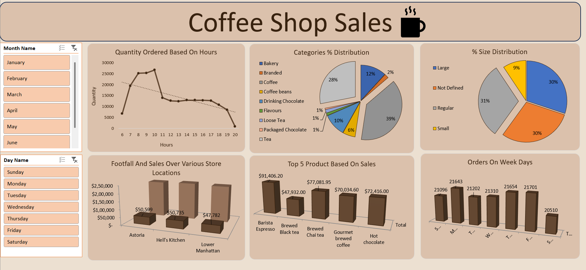

# ☕ Coffee Shop Sales Analysis (Excel)

## 📌 Overview
Analyzed coffee shop sales data to identify trends, customer behavior, and business insights using Excel.

## 🛠️ Tools Used
- Microsoft Excel  
- Pivot Tables  
- Charts & Slicers  
- Data Cleaning  

## 📊 Key Analysis
- Sales trends over time (daily/monthly)  
- Product category performance  
- Store/location-based sales  
- Peak sales hours  

## 🔍 Key Insights
- Identified top-performing products driving revenue  
- Found peak sales hours for better decision-making  
- Discovered patterns in sales trends  

## 📁 Files Included
- Excel dataset  
- Dashboard screenshots  

## 🚀 Conclusion
This project showcases skills in data cleaning, analysis, and dashboard creation using Excel to generate actionable insights.
